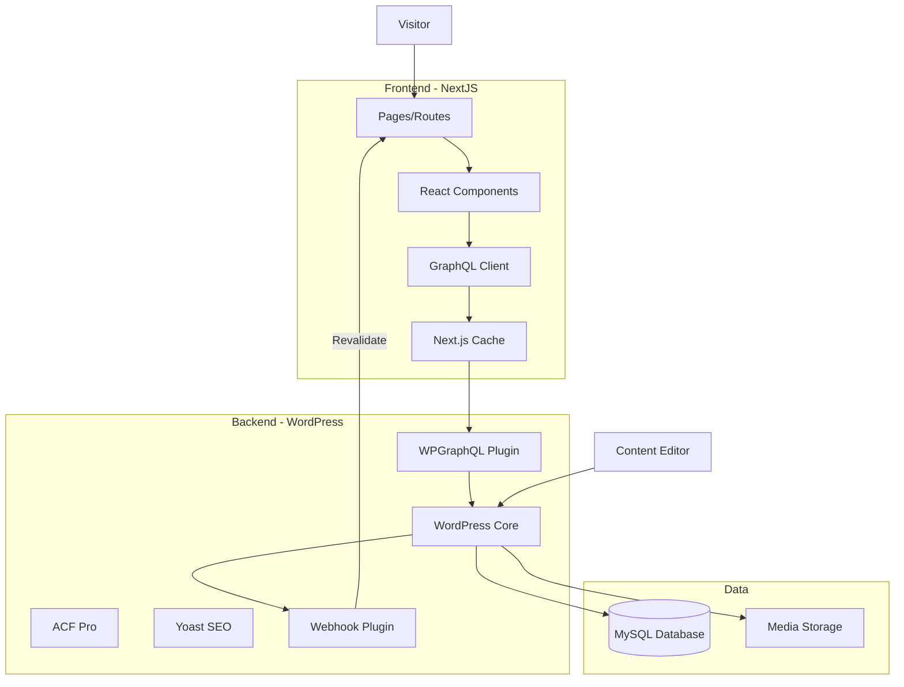

# Design Document: NextJS + WordPress Headless Application

## Overview

Thiết kế này mô tả kiến trúc và implementation cho ứng dụng web sử dụng:
- **NextJS 14** với App Router làm frontend
- **WordPress** với WPGraphQL làm headless CMS
- **TypeScript** cho type safety
- **Tailwind CSS** cho styling

### Tech Stack

| Layer | Technology |
|-------|------------|
| Frontend Framework | NextJS 14 (App Router) |
| Language | TypeScript |
| Styling | Tailwind CSS |
| GraphQL Client | Apollo Client / graphql-request |
| CMS | WordPress 6.x |
| CMS API | WPGraphQL |
| Custom Fields | ACF Pro + WPGraphQL for ACF |
| SEO | Yoast SEO + WPGraphQL Yoast SEO Addon |
| Local Dev | Docker Compose |

## Architecture

### High-Level Architecture



### Project Structure

```
project-root/
├── frontend/                    # NextJS Application
│   ├── src/
│   │   ├── app/                # App Router pages
│   │   │   ├── layout.tsx
│   │   │   ├── page.tsx
│   │   │   ├── blog/
│   │   │   │   ├── page.tsx
│   │   │   │   └── [slug]/
│   │   │   │       └── page.tsx
│   │   │   ├── [slug]/
│   │   │   │   └── page.tsx
│   │   │   └── api/
│   │   │       └── revalidate/
│   │   │           └── route.ts
│   │   ├── components/
│   │   │   ├── layout/
│   │   │   │   ├── Header.tsx
│   │   │   │   ├── Footer.tsx
│   │   │   │   └── Navigation.tsx
│   │   │   ├── posts/
│   │   │   │   ├── PostCard.tsx
│   │   │   │   ├── PostList.tsx
│   │   │   │   └── PostContent.tsx
│   │   │   ├── pages/
│   │   │   │   └── PageContent.tsx
│   │   │   └── ui/
│   │   │       ├── Button.tsx
│   │   │       └── Image.tsx
│   │   ├── lib/
│   │   │   ├── wordpress/
│   │   │   │   ├── client.ts
│   │   │   │   ├── queries.ts
│   │   │   │   └── types.ts
│   │   │   └── utils/
│   │   │       └── helpers.ts
│   │   └── styles/
│   │       └── globals.css
│   ├── public/
│   ├── .env.local
│   ├── next.config.js
│   ├── tailwind.config.ts
│   ├── tsconfig.json
│   └── package.json
│
├── wordpress/                   # WordPress Docker setup
│   ├── Dockerfile
│   ├── wp-config/
│   │   └── wp-config.php
│   ├── plugins/                # Must-use plugins
│   │   └── mu-plugins/
│   └── themes/
│       └── headless-theme/
│
├── docker-compose.yml
└── README.md
```

## Components and Interfaces

### 1. GraphQL Client Configuration

```typescript
// src/lib/wordpress/client.ts
import { GraphQLClient } from 'graphql-request';

const endpoint = process.env.WORDPRESS_GRAPHQL_ENDPOINT!;

export const graphqlClient = new GraphQLClient(endpoint, {
  headers: {
    'Content-Type': 'application/json',
  },
});

export async function fetchGraphQL<T>(
  query: string,
  variables?: Record<string, unknown>,
  options?: { revalidate?: number; tags?: string[] }
): Promise<T> {
  const { revalidate = 60, tags = [] } = options || {};
  
  const response = await fetch(endpoint, {
    method: 'POST',
    headers: { 'Content-Type': 'application/json' },
    body: JSON.stringify({ query, variables }),
    next: { revalidate, tags },
  });

  const json = await response.json();
  
  if (json.errors) {
    throw new Error(json.errors[0].message);
  }
  
  return json.data;
}
```

### 2. GraphQL Queries

```typescript
// src/lib/wordpress/queries.ts
export const GET_POSTS = `
  query GetPosts($first: Int!, $after: String) {
    posts(first: $first, after: $after) {
      pageInfo {
        hasNextPage
        endCursor
      }
      nodes {
        id
        databaseId
        title
        slug
        excerpt
        date
        featuredImage {
          node {
            sourceUrl
            altText
            mediaDetails {
              width
              height
            }
          }
        }
        categories {
          nodes {
            id
            name
            slug
          }
        }
      }
    }
  }
`;

export const GET_POST_BY_SLUG = `
  query GetPostBySlug($slug: ID!) {
    post(id: $slug, idType: SLUG) {
      id
      databaseId
      title
      slug
      content
      date
      modified
      featuredImage {
        node {
          sourceUrl
          altText
          mediaDetails {
            width
            height
          }
        }
      }
      categories {
        nodes {
          id
          name
          slug
        }
      }
      tags {
        nodes {
          id
          name
          slug
        }
      }
      seo {
        title
        metaDesc
        opengraphTitle
        opengraphDescription
        opengraphImage {
          sourceUrl
        }
        twitterTitle
        twitterDescription
      }
    }
  }
`;

export const GET_PAGE_BY_SLUG = `
  query GetPageBySlug($slug: ID!) {
    page(id: $slug, idType: URI) {
      id
      databaseId
      title
      slug
      content
      featuredImage {
        node {
          sourceUrl
          altText
        }
      }
      seo {
        title
        metaDesc
        opengraphTitle
        opengraphDescription
        opengraphImage {
          sourceUrl
        }
      }
    }
  }
`;

export const GET_MENU = `
  query GetMenu($location: MenuLocationEnum!) {
    menuItems(where: { location: $location }, first: 50) {
      nodes {
        id
        label
        url
        path
        parentId
        cssClasses
      }
    }
  }
`;

export const GET_ALL_POSTS_SLUGS = `
  query GetAllPostsSlugs {
    posts(first: 1000) {
      nodes {
        slug
      }
    }
  }
`;

export const GET_ALL_PAGES_SLUGS = `
  query GetAllPagesSlugs {
    pages(first: 1000) {
      nodes {
        slug
        uri
      }
    }
  }
`;
```

### 3. TypeScript Types

```typescript
// src/lib/wordpress/types.ts
export interface WPImage {
  sourceUrl: string;
  altText: string;
  mediaDetails?: {
    width: number;
    height: number;
  };
}

export interface WPCategory {
  id: string;
  name: string;
  slug: string;
}

export interface WPTag {
  id: string;
  name: string;
  slug: string;
}

export interface WPSeo {
  title: string;
  metaDesc: string;
  opengraphTitle: string;
  opengraphDescription: string;
  opengraphImage?: {
    sourceUrl: string;
  };
  twitterTitle?: string;
  twitterDescription?: string;
}

export interface WPPost {
  id: string;
  databaseId: number;
  title: string;
  slug: string;
  excerpt?: string;
  content?: string;
  date: string;
  modified?: string;
  featuredImage?: {
    node: WPImage;
  };
  categories?: {
    nodes: WPCategory[];
  };
  tags?: {
    nodes: WPTag[];
  };
  seo?: WPSeo;
}

export interface WPPage {
  id: string;
  databaseId: number;
  title: string;
  slug: string;
  content: string;
  featuredImage?: {
    node: WPImage;
  };
  seo?: WPSeo;
}

export interface WPMenuItem {
  id: string;
  label: string;
  url: string;
  path: string;
  parentId: string | null;
  cssClasses?: string[];
}

export interface PageInfo {
  hasNextPage: boolean;
  endCursor: string;
}
```

### 4. Page Components

```typescript
// src/app/blog/page.tsx
import { fetchGraphQL } from '@/lib/wordpress/client';
import { GET_POSTS } from '@/lib/wordpress/queries';
import { WPPost, PageInfo } from '@/lib/wordpress/types';
import PostList from '@/components/posts/PostList';

interface PostsResponse {
  posts: {
    pageInfo: PageInfo;
    nodes: WPPost[];
  };
}

export const revalidate = 60;

export default async function BlogPage() {
  const data = await fetchGraphQL<PostsResponse>(
    GET_POSTS,
    { first: 10 },
    { tags: ['posts'] }
  );

  return (
    <main className="container mx-auto px-4 py-8">
      <h1 className="text-4xl font-bold mb-8">Blog</h1>
      <PostList posts={data.posts.nodes} />
    </main>
  );
}
```

```typescript
// src/app/blog/[slug]/page.tsx
import { fetchGraphQL } from '@/lib/wordpress/client';
import { GET_POST_BY_SLUG, GET_ALL_POSTS_SLUGS } from '@/lib/wordpress/queries';
import { WPPost } from '@/lib/wordpress/types';
import PostContent from '@/components/posts/PostContent';
import { notFound } from 'next/navigation';
import { Metadata } from 'next';

interface PostResponse {
  post: WPPost | null;
}

export async function generateStaticParams() {
  const data = await fetchGraphQL<{ posts: { nodes: { slug: string }[] } }>(
    GET_ALL_POSTS_SLUGS
  );
  return data.posts.nodes.map((post) => ({ slug: post.slug }));
}

export async function generateMetadata({ params }: { params: { slug: string } }): Promise<Metadata> {
  const data = await fetchGraphQL<PostResponse>(GET_POST_BY_SLUG, { slug: params.slug });
  
  if (!data.post) return { title: 'Post Not Found' };
  
  const { seo, title, featuredImage } = data.post;
  
  return {
    title: seo?.title || title,
    description: seo?.metaDesc,
    openGraph: {
      title: seo?.opengraphTitle || title,
      description: seo?.opengraphDescription,
      images: seo?.opengraphImage?.sourceUrl ? [seo.opengraphImage.sourceUrl] : 
              featuredImage?.node.sourceUrl ? [featuredImage.node.sourceUrl] : [],
    },
    twitter: {
      card: 'summary_large_image',
      title: seo?.twitterTitle || title,
      description: seo?.twitterDescription,
    },
  };
}

export default async function PostPage({ params }: { params: { slug: string } }) {
  const data = await fetchGraphQL<PostResponse>(
    GET_POST_BY_SLUG,
    { slug: params.slug },
    { tags: [`post-${params.slug}`] }
  );

  if (!data.post) notFound();

  return <PostContent post={data.post} />;
}
```

### 5. Revalidation API Route

```typescript
// src/app/api/revalidate/route.ts
import { revalidateTag, revalidatePath } from 'next/cache';
import { NextRequest, NextResponse } from 'next/server';

export async function POST(request: NextRequest) {
  const secret = request.headers.get('x-revalidate-secret');
  
  if (secret !== process.env.REVALIDATE_SECRET) {
    return NextResponse.json({ message: 'Invalid secret' }, { status: 401 });
  }

  try {
    const body = await request.json();
    const { type, slug } = body;

    switch (type) {
      case 'post':
        revalidateTag('posts');
        if (slug) {
          revalidateTag(`post-${slug}`);
          revalidatePath(`/blog/${slug}`);
        }
        revalidatePath('/blog');
        break;
      case 'page':
        revalidateTag('pages');
        if (slug) {
          revalidateTag(`page-${slug}`);
          revalidatePath(`/${slug}`);
        }
        break;
      case 'menu':
        revalidateTag('menu');
        break;
      default:
        revalidateTag('posts');
        revalidateTag('pages');
    }

    console.log(`Revalidated: type=${type}, slug=${slug}`);
    
    return NextResponse.json({ 
      revalidated: true, 
      type, 
      slug,
      timestamp: Date.now() 
    });
  } catch (error) {
    console.error('Revalidation error:', error);
    return NextResponse.json({ message: 'Error revalidating' }, { status: 500 });
  }
}
```

### 6. Navigation Component

```typescript
// src/components/layout/Navigation.tsx
'use client';

import Link from 'next/link';
import { usePathname } from 'next/navigation';
import { WPMenuItem } from '@/lib/wordpress/types';
import { useState } from 'react';

interface NavigationProps {
  items: WPMenuItem[];
}

function buildMenuTree(items: WPMenuItem[]): (WPMenuItem & { children: WPMenuItem[] })[] {
  const itemMap = new Map<string, WPMenuItem & { children: WPMenuItem[] }>();
  const roots: (WPMenuItem & { children: WPMenuItem[] })[] = [];

  items.forEach(item => {
    itemMap.set(item.id, { ...item, children: [] });
  });

  items.forEach(item => {
    const node = itemMap.get(item.id)!;
    if (item.parentId && itemMap.has(item.parentId)) {
      itemMap.get(item.parentId)!.children.push(node);
    } else {
      roots.push(node);
    }
  });

  return roots;
}

export default function Navigation({ items }: NavigationProps) {
  const pathname = usePathname();
  const [mobileMenuOpen, setMobileMenuOpen] = useState(false);
  const menuTree = buildMenuTree(items);

  const isActive = (path: string) => pathname === path;

  return (
    <nav className="bg-white shadow">
      <div className="container mx-auto px-4">
        <div className="flex justify-between items-center h-16">
          <Link href="/" className="text-xl font-bold">
            Logo
          </Link>

          {/* Desktop Menu */}
          <div className="hidden md:flex space-x-8">
            {menuTree.map((item) => (
              <div key={item.id} className="relative group">
                <Link
                  href={item.path}
                  className={`py-2 ${isActive(item.path) ? 'text-blue-600 font-semibold' : 'text-gray-700 hover:text-blue-600'}`}
                >
                  {item.label}
                </Link>
                {item.children.length > 0 && (
                  <div className="absolute left-0 mt-2 w-48 bg-white shadow-lg rounded-md opacity-0 invisible group-hover:opacity-100 group-hover:visible transition-all">
                    {item.children.map((child) => (
                      <Link
                        key={child.id}
                        href={child.path}
                        className="block px-4 py-2 text-gray-700 hover:bg-gray-100"
                      >
                        {child.label}
                      </Link>
                    ))}
                  </div>
                )}
              </div>
            ))}
          </div>

          {/* Mobile Menu Button */}
          <button
            className="md:hidden"
            onClick={() => setMobileMenuOpen(!mobileMenuOpen)}
          >
            <svg className="w-6 h-6" fill="none" stroke="currentColor" viewBox="0 0 24 24">
              <path strokeLinecap="round" strokeLinejoin="round" strokeWidth={2} d="M4 6h16M4 12h16M4 18h16" />
            </svg>
          </button>
        </div>

        {/* Mobile Menu */}
        {mobileMenuOpen && (
          <div className="md:hidden py-4">
            {menuTree.map((item) => (
              <div key={item.id}>
                <Link
                  href={item.path}
                  className={`block py-2 ${isActive(item.path) ? 'text-blue-600 font-semibold' : 'text-gray-700'}`}
                  onClick={() => setMobileMenuOpen(false)}
                >
                  {item.label}
                </Link>
                {item.children.map((child) => (
                  <Link
                    key={child.id}
                    href={child.path}
                    className="block py-2 pl-4 text-gray-600"
                    onClick={() => setMobileMenuOpen(false)}
                  >
                    {child.label}
                  </Link>
                ))}
              </div>
            ))}
          </div>
        )}
      </div>
    </nav>
  );
}
```

## Data Models

### Environment Variables

```typescript
// src/lib/env.ts
import { z } from 'zod';

const envSchema = z.object({
  WORDPRESS_GRAPHQL_ENDPOINT: z.string().url(),
  WORDPRESS_API_URL: z.string().url(),
  REVALIDATE_SECRET: z.string().min(32),
  NEXT_PUBLIC_SITE_URL: z.string().url(),
});

export const env = envSchema.parse({
  WORDPRESS_GRAPHQL_ENDPOINT: process.env.WORDPRESS_GRAPHQL_ENDPOINT,
  WORDPRESS_API_URL: process.env.WORDPRESS_API_URL,
  REVALIDATE_SECRET: process.env.REVALIDATE_SECRET,
  NEXT_PUBLIC_SITE_URL: process.env.NEXT_PUBLIC_SITE_URL,
});
```

### Docker Compose Configuration

```yaml
# docker-compose.yml
version: '3.8'

services:
  wordpress:
    build:
      context: ./wordpress
      dockerfile: Dockerfile
    ports:
      - "8080:80"
    environment:
      WORDPRESS_DB_HOST: db
      WORDPRESS_DB_USER: wordpress
      WORDPRESS_DB_PASSWORD: wordpress
      WORDPRESS_DB_NAME: wordpress
      WORDPRESS_DEBUG: 1
    volumes:
      - wordpress_data:/var/www/html
      - ./wordpress/plugins:/var/www/html/wp-content/plugins
      - ./wordpress/themes:/var/www/html/wp-content/themes
    depends_on:
      - db
    networks:
      - wp-network

  db:
    image: mysql:8.0
    environment:
      MYSQL_DATABASE: wordpress
      MYSQL_USER: wordpress
      MYSQL_PASSWORD: wordpress
      MYSQL_ROOT_PASSWORD: rootpassword
    volumes:
      - db_data:/var/lib/mysql
    networks:
      - wp-network

  phpmyadmin:
    image: phpmyadmin/phpmyadmin
    ports:
      - "8081:80"
    environment:
      PMA_HOST: db
      MYSQL_ROOT_PASSWORD: rootpassword
    depends_on:
      - db
    networks:
      - wp-network

volumes:
  wordpress_data:
  db_data:

networks:
  wp-network:
    driver: bridge
```

### WordPress Dockerfile

```dockerfile
# wordpress/Dockerfile
FROM wordpress:6.4-php8.2-apache

# Install required PHP extensions
RUN docker-php-ext-install mysqli pdo pdo_mysql

# Install WP-CLI
RUN curl -O https://raw.githubusercontent.com/wp-cli/builds/gh-pages/phar/wp-cli.phar \
    && chmod +x wp-cli.phar \
    && mv wp-cli.phar /usr/local/bin/wp

# Copy custom configuration
COPY wp-config/wp-config-docker.php /var/www/html/

# Set permissions
RUN chown -R www-data:www-data /var/www/html

EXPOSE 80
```

## Correctness Properties

*A property is a characteristic or behavior that should hold true across all valid executions of a system-essentially, a formal statement about what the system should do. Properties serve as the bridge between human-readable specifications and machine-verifiable correctness guarantees.*

### Property 1: Environment variable validation

*For any* set of environment variables, if any required variable is missing or invalid (e.g., non-URL for endpoint), the application should fail to start with a descriptive error message.

**Validates: Requirements 1.3**

### Property 2: GraphQL response type safety

*For any* GraphQL query response from WordPress, the parsed response should match the expected TypeScript type structure, with null/undefined handled appropriately for optional fields.

**Validates: Requirements 2.2**

### Property 3: GraphQL error handling

*For any* GraphQL error response (network error, query error, server error), the application should catch the error and return appropriate fallback content without crashing.

**Validates: Requirements 2.3**

### Property 4: Post list rendering completeness

*For any* list of posts returned from WordPress, each post card should display: title (required), excerpt (if available), featured image (if available), and publication date.

**Validates: Requirements 3.1**

### Property 5: Post content rendering

*For any* single post with HTML content, the rendered output should preserve the HTML structure and display all content elements (paragraphs, headings, images, lists).

**Validates: Requirements 3.2**

### Property 6: Category and tag linking

*For any* post with categories or tags, each category/tag should be rendered as a clickable link pointing to the correct archive URL (`/category/{slug}` or `/tag/{slug}`).

**Validates: Requirements 3.3**

### Property 7: Page content rendering

*For any* WordPress page with content, the NextJS application should render the page content correctly, including any ACF custom fields if present.

**Validates: Requirements 4.1, 4.2**

### Property 8: Menu tree building

*For any* flat list of menu items with parent-child relationships, the `buildMenuTree` function should correctly construct a nested tree structure where all children are grouped under their parent.

**Validates: Requirements 5.2**

### Property 9: Active menu highlighting

*For any* current pathname, the navigation component should correctly identify and highlight the menu item whose path matches the current pathname.

**Validates: Requirements 5.3**

### Property 10: SEO metadata completeness

*For any* page or post with SEO data from Yoast, the rendered page should include: meta title, meta description, Open Graph tags (og:title, og:description, og:image), and Twitter Card tags.

**Validates: Requirements 6.1, 6.2**

### Property 11: JSON-LD structured data validity

*For any* rendered article or page, the JSON-LD structured data should be valid according to Schema.org specifications and include required fields (headline, datePublished, author for articles).

**Validates: Requirements 6.4**

### Property 12: Sitemap content completeness

*For any* set of published posts and pages in WordPress, the generated XML sitemap should contain URLs for all published content items.

**Validates: Requirements 6.3**

### Property 13: Webhook secret validation

*For any* revalidation webhook request, if the `x-revalidate-secret` header does not match the configured secret, the endpoint should return 401 Unauthorized without processing the request.

**Validates: Requirements 8.3**

### Property 14: Content revalidation on update

*For any* content update webhook (post or page), the NextJS application should invalidate the appropriate cache tags and trigger revalidation of affected paths.

**Validates: Requirements 3.5, 4.4, 8.1, 8.2**

## Error Handling

### GraphQL Error Handling

```typescript
// src/lib/wordpress/client.ts
export class WordPressAPIError extends Error {
  constructor(
    message: string,
    public statusCode?: number,
    public graphqlErrors?: Array<{ message: string }>
  ) {
    super(message);
    this.name = 'WordPressAPIError';
  }
}

export async function fetchGraphQL<T>(
  query: string,
  variables?: Record<string, unknown>,
  options?: { revalidate?: number; tags?: string[] }
): Promise<T> {
  try {
    const response = await fetch(endpoint, {
      method: 'POST',
      headers: { 'Content-Type': 'application/json' },
      body: JSON.stringify({ query, variables }),
      next: { revalidate: options?.revalidate ?? 60, tags: options?.tags },
    });

    if (!response.ok) {
      throw new WordPressAPIError(
        `HTTP error: ${response.status}`,
        response.status
      );
    }

    const json = await response.json();

    if (json.errors) {
      throw new WordPressAPIError(
        json.errors[0].message,
        undefined,
        json.errors
      );
    }

    return json.data;
  } catch (error) {
    if (error instanceof WordPressAPIError) throw error;
    throw new WordPressAPIError(
      error instanceof Error ? error.message : 'Unknown error'
    );
  }
}
```

### Error Boundary Component

```typescript
// src/components/ErrorBoundary.tsx
'use client';

import { Component, ReactNode } from 'react';

interface Props {
  children: ReactNode;
  fallback?: ReactNode;
}

interface State {
  hasError: boolean;
}

export class ErrorBoundary extends Component<Props, State> {
  constructor(props: Props) {
    super(props);
    this.state = { hasError: false };
  }

  static getDerivedStateFromError(): State {
    return { hasError: true };
  }

  render() {
    if (this.state.hasError) {
      return this.props.fallback || (
        <div className="p-8 text-center">
          <h2 className="text-xl font-bold text-red-600">Something went wrong</h2>
          <p className="text-gray-600 mt-2">Please try refreshing the page.</p>
        </div>
      );
    }

    return this.props.children;
  }
}
```

### 404 Page

```typescript
// src/app/not-found.tsx
import Link from 'next/link';

export default function NotFound() {
  return (
    <div className="min-h-screen flex items-center justify-center">
      <div className="text-center">
        <h1 className="text-6xl font-bold text-gray-900">404</h1>
        <p className="text-xl text-gray-600 mt-4">Page not found</p>
        <Link
          href="/"
          className="mt-8 inline-block px-6 py-3 bg-blue-600 text-white rounded-lg hover:bg-blue-700"
        >
          Go Home
        </Link>
      </div>
    </div>
  );
}
```

## Testing Strategy

### Unit Testing Framework

- **Framework**: Vitest (fast, ESM-native, compatible with Jest API)
- **Testing Library**: React Testing Library for component tests
- **Mocking**: MSW (Mock Service Worker) for API mocking

### Property-Based Testing

- **Framework**: fast-check
- **Minimum iterations**: 100 per property test

**Test Annotation Format:**
```typescript
// **Feature: nextjs-wordpress-app, Property {number}: {property_text}**
// **Validates: Requirements X.Y**
```

### Test Structure

```
frontend/
├── src/
│   ├── __tests__/
│   │   ├── lib/
│   │   │   ├── client.test.ts
│   │   │   ├── queries.test.ts
│   │   │   └── env.test.ts
│   │   ├── components/
│   │   │   ├── Navigation.test.tsx
│   │   │   ├── PostCard.test.tsx
│   │   │   └── PostContent.test.tsx
│   │   └── properties/
│   │       ├── menu-tree.property.test.ts
│   │       ├── seo-metadata.property.test.ts
│   │       └── webhook-validation.property.test.ts
│   └── ...
├── vitest.config.ts
└── vitest.setup.ts
```

### Example Property Test

```typescript
// src/__tests__/properties/menu-tree.property.test.ts
import { describe, it, expect } from 'vitest';
import * as fc from 'fast-check';
import { buildMenuTree } from '@/components/layout/Navigation';

// **Feature: nextjs-wordpress-app, Property 8: Menu tree building**
// **Validates: Requirements 5.2**
describe('Property: Menu tree building', () => {
  it('should correctly build nested menu tree from flat items', () => {
    const menuItemArb = fc.record({
      id: fc.uuid(),
      label: fc.string({ minLength: 1, maxLength: 50 }),
      url: fc.webUrl(),
      path: fc.string({ minLength: 1 }).map(s => `/${s}`),
      parentId: fc.option(fc.uuid(), { nil: null }),
      cssClasses: fc.array(fc.string()),
    });

    fc.assert(
      fc.property(fc.array(menuItemArb, { minLength: 0, maxLength: 20 }), (items) => {
        const tree = buildMenuTree(items);
        
        // All root items should have no parent or parent not in list
        const itemIds = new Set(items.map(i => i.id));
        tree.forEach(root => {
          expect(root.parentId === null || !itemIds.has(root.parentId)).toBe(true);
        });
        
        // Total items in tree should equal input items
        const countItems = (nodes: typeof tree): number => 
          nodes.reduce((sum, n) => sum + 1 + countItems(n.children), 0);
        expect(countItems(tree)).toBe(items.length);
      }),
      { numRuns: 100 }
    );
  });
});
```

### Integration Tests

```typescript
// src/__tests__/integration/api-revalidate.test.ts
import { describe, it, expect, vi } from 'vitest';
import { POST } from '@/app/api/revalidate/route';
import { NextRequest } from 'next/server';

describe('Revalidation API', () => {
  it('should reject requests without valid secret', async () => {
    const request = new NextRequest('http://localhost/api/revalidate', {
      method: 'POST',
      headers: { 'x-revalidate-secret': 'invalid' },
      body: JSON.stringify({ type: 'post', slug: 'test' }),
    });

    const response = await POST(request);
    expect(response.status).toBe(401);
  });

  it('should accept requests with valid secret', async () => {
    vi.stubEnv('REVALIDATE_SECRET', 'valid-secret-32-characters-long!');
    
    const request = new NextRequest('http://localhost/api/revalidate', {
      method: 'POST',
      headers: { 'x-revalidate-secret': 'valid-secret-32-characters-long!' },
      body: JSON.stringify({ type: 'post', slug: 'test' }),
    });

    const response = await POST(request);
    expect(response.status).toBe(200);
  });
});
```
