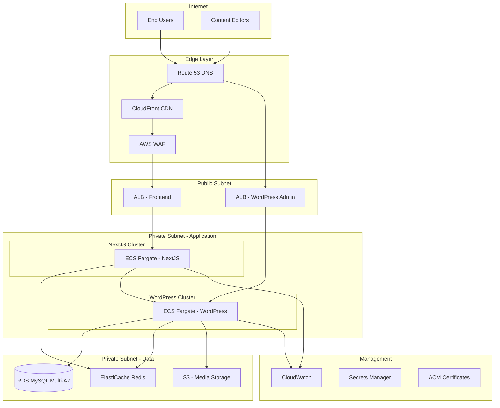
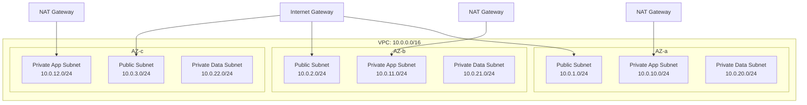

# Design Document: NextJS + WordPress Headless Infrastructure

## Overview

Thiết kế này mô tả kiến trúc infrastructure cho hệ thống web sử dụng NextJS làm frontend và WordPress Headless làm CMS. Hệ thống được thiết kế theo nguyên tắc:

- **High Availability**: Multi-AZ deployment, auto-scaling, failover tự động
- **Security**: Defense in depth với WAF, network segmentation, encryption
- **Performance**: CDN, caching layers, optimized database
- **Scalability**: Horizontal scaling cho cả frontend và backend
- **Observability**: Comprehensive monitoring, logging, tracing

### Target Cloud Provider: AWS

Thiết kế này sử dụng AWS services, nhưng có thể adapt sang GCP hoặc Azure với các services tương đương.

## Architecture

### High-Level Architecture Diagram



### Network Architecture



## Components and Interfaces

### 1. DNS & CDN Layer

| Component | Service | Purpose |
|-----------|---------|---------|
| DNS | Route 53 | Domain management, health checks, failover routing |
| CDN | CloudFront | Static asset caching, SSL termination, DDoS protection |
| WAF | AWS WAF | Web application firewall, rate limiting, SQL injection protection |
| Certificates | ACM | SSL/TLS certificate management, auto-renewal |

**Configuration:**
- CloudFront Origins: ALB Frontend, S3 Media
- Cache Behaviors: Static assets (1 year), API responses (configurable TTL)
- WAF Rules: OWASP Top 10, rate limiting 1000 req/min/IP

### 2. Load Balancing Layer

| Component | Service | Purpose |
|-----------|---------|---------|
| Frontend LB | Application Load Balancer | Distribute traffic to NextJS containers |
| WordPress LB | Application Load Balancer | Distribute traffic to WordPress containers |

**Configuration:**
- Health check interval: 10 seconds
- Unhealthy threshold: 2 consecutive failures
- Target deregistration delay: 30 seconds
- Sticky sessions: Disabled for NextJS, Enabled for WordPress admin

### 3. Compute Layer

#### NextJS Application (ECS Fargate)

```yaml
Service Configuration:
  Task Definition:
    CPU: 512 (0.5 vCPU)
    Memory: 1024 MB
    Container:
      Image: nextjs-app:latest
      Port: 3000
      Environment:
        - WORDPRESS_API_URL
        - REDIS_URL
        - NODE_ENV: production
  
  Auto Scaling:
    Min Capacity: 2
    Max Capacity: 10
    Target CPU Utilization: 70%
    Scale Out Cooldown: 60 seconds
    Scale In Cooldown: 300 seconds
```

#### WordPress Application (ECS Fargate)

```yaml
Service Configuration:
  Task Definition:
    CPU: 1024 (1 vCPU)
    Memory: 2048 MB
    Container:
      Image: wordpress-headless:latest
      Port: 80
      Environment:
        - DB_HOST
        - DB_NAME
        - DB_USER
        - REDIS_HOST
        - S3_BUCKET
        - WP_HOME
        - WP_SITEURL
  
  Auto Scaling:
    Min Capacity: 2
    Max Capacity: 6
    Target CPU Utilization: 70%
```

### 4. Data Layer

#### MySQL Database (RDS)

```yaml
RDS Configuration:
  Engine: MySQL 8.0
  Instance Class: db.r6g.large
  Storage: 100 GB gp3
  Multi-AZ: Enabled
  
  Backup:
    Automated Backup: Enabled
    Retention Period: 30 days
    Backup Window: 03:00-04:00 UTC
    
  Security:
    Encryption at Rest: AES-256 (KMS)
    Encryption in Transit: TLS 1.2
    
  Performance:
    Max Connections: 500
    Connection Pooling: RDS Proxy
```

#### Redis Cache (ElastiCache)

```yaml
ElastiCache Configuration:
  Engine: Redis 7.0
  Node Type: cache.r6g.large
  Cluster Mode: Enabled
  Replicas per Shard: 2
  Number of Shards: 2
  
  Configuration:
    maxmemory-policy: allkeys-lru
    timeout: 300
    
  Failover:
    Automatic Failover: Enabled
    Multi-AZ: Enabled
```

#### Media Storage (S3)

```yaml
S3 Configuration:
  Bucket: media-{environment}-{account-id}
  
  Versioning: Enabled
  
  Lifecycle Rules:
    - Transition to IA: 90 days
    - Transition to Glacier: 365 days
    
  Replication:
    Cross-Region: Enabled (DR region)
    
  Security:
    Block Public Access: Enabled
    Encryption: SSE-S3
    Access: Via CloudFront OAI only
```

### 5. Security Components

#### Security Groups

```yaml
Security Groups:
  ALB-Frontend-SG:
    Inbound:
      - 443/tcp from 0.0.0.0/0 (HTTPS)
    Outbound:
      - All to NextJS-SG
      
  ALB-WordPress-SG:
    Inbound:
      - 443/tcp from Office-IP-Range
    Outbound:
      - All to WordPress-SG
      
  NextJS-SG:
    Inbound:
      - 3000/tcp from ALB-Frontend-SG
    Outbound:
      - 443/tcp to WordPress-SG
      - 6379/tcp to Redis-SG
      
  WordPress-SG:
    Inbound:
      - 80/tcp from ALB-WordPress-SG
      - 443/tcp from NextJS-SG
    Outbound:
      - 3306/tcp to RDS-SG
      - 6379/tcp to Redis-SG
      - 443/tcp to S3 (VPC Endpoint)
      
  RDS-SG:
    Inbound:
      - 3306/tcp from WordPress-SG
      
  Redis-SG:
    Inbound:
      - 6379/tcp from NextJS-SG
      - 6379/tcp from WordPress-SG
```

#### IAM Roles

```yaml
IAM Roles:
  NextJS-Task-Role:
    Policies:
      - SecretsManagerReadOnly (scoped)
      - CloudWatchLogsFullAccess
      
  WordPress-Task-Role:
    Policies:
      - S3MediaBucketAccess (custom)
      - SecretsManagerReadOnly (scoped)
      - CloudWatchLogsFullAccess
      
  CodePipeline-Role:
    Policies:
      - CodePipelineServiceRole
      - ECSDeployAccess
      - ECRPushAccess
```

### 6. Monitoring & Logging

#### CloudWatch Configuration

```yaml
CloudWatch:
  Metrics:
    - ECS CPU/Memory Utilization
    - ALB Request Count, Latency, Error Rate
    - RDS Connections, CPU, Storage
    - ElastiCache Hit Rate, Memory
    
  Alarms:
    Critical:
      - ECS Task Count < 2
      - RDS CPU > 90% for 5 minutes
      - ALB 5xx Error Rate > 5%
      - ElastiCache Memory > 90%
      
    Warning:
      - ECS CPU > 80% for 10 minutes
      - RDS Storage < 20%
      - API Latency p99 > 1000ms
      
  Logs:
    Log Groups:
      - /ecs/nextjs-app
      - /ecs/wordpress-app
      - /rds/mysql/error
      - /rds/mysql/slowquery
    Retention: 30 days
```

#### Distributed Tracing (X-Ray)

```yaml
X-Ray Configuration:
  Sampling:
    Default: 5%
    Error Requests: 100%
    
  Service Map:
    - NextJS -> WordPress API
    - WordPress -> RDS
    - WordPress -> Redis
    - WordPress -> S3
```

## Data Models

### Infrastructure State (Terraform)

```hcl
# VPC Module
module "vpc" {
  source  = "terraform-aws-modules/vpc/aws"
  
  name = "${var.project}-${var.environment}"
  cidr = "10.0.0.0/16"
  
  azs             = ["ap-southeast-1a", "ap-southeast-1b", "ap-southeast-1c"]
  private_subnets = ["10.0.10.0/24", "10.0.11.0/24", "10.0.12.0/24"]
  public_subnets  = ["10.0.1.0/24", "10.0.2.0/24", "10.0.3.0/24"]
  database_subnets = ["10.0.20.0/24", "10.0.21.0/24", "10.0.22.0/24"]
  
  enable_nat_gateway = true
  single_nat_gateway = false
  one_nat_gateway_per_az = true
}

# ECS Cluster
resource "aws_ecs_cluster" {
  name = "${var.project}-${var.environment}"
  
  setting {
    name  = "containerInsights"
    value = "enabled"
  }
}

# RDS Instance
resource "aws_db_instance" "wordpress" {
  identifier = "${var.project}-wordpress-${var.environment}"
  
  engine         = "mysql"
  engine_version = "8.0"
  instance_class = "db.r6g.large"
  
  allocated_storage     = 100
  max_allocated_storage = 500
  storage_type          = "gp3"
  storage_encrypted     = true
  
  multi_az = true
  
  backup_retention_period = 30
  backup_window          = "03:00-04:00"
  maintenance_window     = "Mon:04:00-Mon:05:00"
  
  deletion_protection = true
}
```

### Environment Configuration

```yaml
# config/production.yaml
environment: production

nextjs:
  replicas:
    min: 2
    max: 10
  resources:
    cpu: 512
    memory: 1024
  env:
    NODE_ENV: production
    REVALIDATE_SECRET: "{{secrets.revalidate_secret}}"

wordpress:
  replicas:
    min: 2
    max: 6
  resources:
    cpu: 1024
    memory: 2048
  plugins:
    - wp-graphql
    - wp-gatsby
    - advanced-custom-fields-pro
    - yoast-seo

database:
  instance_class: db.r6g.large
  storage: 100
  multi_az: true

cache:
  node_type: cache.r6g.large
  num_shards: 2
  replicas_per_shard: 2

cdn:
  price_class: PriceClass_200
  cache_ttl:
    static: 31536000  # 1 year
    api: 300          # 5 minutes
```

## Correctness Properties

*A property is a characteristic or behavior that should hold true across all valid executions of a system-essentially, a formal statement about what the system should do. Properties serve as the bridge between human-readable specifications and machine-verifiable correctness guarantees.*

Based on the prework analysis, the following correctness properties have been identified:

### Property 1: Auto-scaling responds to load

*For any* traffic load pattern that exceeds 70% CPU utilization threshold, the auto-scaling system should increase the number of instances within the configured scale-out cooldown period (60 seconds).

**Validates: Requirements 1.2**

### Property 2: Failover SLA compliance

*For any* component failure (NextJS instance, WordPress instance, database primary, cache node), the system should complete failover to healthy/standby resources within the specified SLA:
- Load balancer failover: 30 seconds
- WordPress failover: 60 seconds
- Database failover: 120 seconds
- Cache failover: 30 seconds

**Validates: Requirements 1.3, 2.4, 3.2, 4.4**

### Property 3: API response time under normal load

*For any* WordPress API request under normal load conditions (< 70% resource utilization), the response time should be less than 500ms at the 95th percentile.

**Validates: Requirements 2.3**

### Property 4: Media storage consistency

*For any* media file uploaded through WordPress, the file should be stored in S3 object storage and accessible via CloudFront CDN within 60 seconds of upload completion.

**Validates: Requirements 2.5**

### Property 5: Database connection management

*For any* number of concurrent database connection requests exceeding the connection pool threshold, the system should queue requests using RDS Proxy without connection errors.

**Validates: Requirements 3.4**

### Property 6: Cache lifecycle management

*For any* cached API response:
- The cache entry should be created with the configured TTL
- The cache entry should be invalidated when TTL expires
- The cache entry should be invalidated when related WordPress content is updated

**Validates: Requirements 4.2, 4.3, 4.5**

### Property 7: WAF malicious request filtering

*For any* request matching WAF rule patterns (SQL injection, XSS, known attack signatures), the WAF should block the request and return 403 status code.

**Validates: Requirements 5.2**

### Property 8: Rate limiting enforcement

*For any* IP address making more than 1000 requests per minute, the API Gateway should reject subsequent requests with 429 status code until the rate limit window resets.

**Validates: Requirements 5.4**

### Property 9: Alert notification timing

*For any* metric threshold breach (CPU > 90%, error rate > 5%, etc.), the alerting system should send notification to the operations team within 5 minutes of breach detection.

**Validates: Requirements 6.2**

### Property 10: Log aggregation completeness

*For any* application log entry generated by NextJS or WordPress containers, the log entry should appear in CloudWatch Logs within 60 seconds.

**Validates: Requirements 6.3**

### Property 11: Deployment rollback on failure

*For any* deployment that fails health checks within the health check grace period, the CD pipeline should automatically rollback to the previous version within 5 minutes.

**Validates: Requirements 7.4**

### Property 12: DR SLA compliance

*For any* disaster recovery scenario:
- RTO (Recovery Time Objective): System should be operational in secondary region within 4 hours
- RPO (Recovery Point Objective): Maximum data loss should be 1 hour
- DNS failover should complete within 5 minutes of DR trigger

**Validates: Requirements 8.2, 8.3, 8.4**

## Error Handling

### Infrastructure Failure Scenarios

| Scenario | Detection | Response | Recovery Time |
|----------|-----------|----------|---------------|
| Single NextJS container crash | ECS health check | Auto-restart container | < 60 seconds |
| All NextJS containers in AZ fail | ALB health check | Route to other AZs | < 30 seconds |
| WordPress container crash | ECS health check | Auto-restart container | < 60 seconds |
| RDS primary failure | RDS monitoring | Automatic failover to standby | < 120 seconds |
| Redis node failure | ElastiCache monitoring | Automatic failover to replica | < 30 seconds |
| S3 unavailable | CloudWatch alarm | Serve from CloudFront cache | Immediate |
| CloudFront edge failure | Route 53 health check | Route to other edges | < 60 seconds |
| Complete AZ failure | Multi-AZ monitoring | Traffic shifts to healthy AZs | < 5 minutes |
| Complete region failure | Route 53 health check | DR failover to secondary region | < 4 hours |

### Application Error Handling

```yaml
Error Handling Strategy:
  NextJS:
    - Implement ISR (Incremental Static Regeneration) fallback
    - Cache WordPress API responses locally
    - Show cached content on API failure
    - Graceful degradation for non-critical features
    
  WordPress:
    - Database connection retry with exponential backoff
    - Redis connection fallback to database
    - S3 upload retry with dead letter queue
    - Rate limiting on API endpoints
    
  Circuit Breaker Pattern:
    - Threshold: 5 failures in 30 seconds
    - Open state duration: 60 seconds
    - Half-open: Allow 1 request to test recovery
```

### Alerting Escalation

```yaml
Escalation Policy:
  Level 1 (Warning):
    - Notify: Slack channel #ops-alerts
    - Response time: 30 minutes
    
  Level 2 (Critical):
    - Notify: PagerDuty on-call
    - Response time: 15 minutes
    
  Level 3 (Emergency):
    - Notify: PagerDuty + Phone call to team lead
    - Response time: 5 minutes
```

## Testing Strategy

### Infrastructure Testing

#### Unit Tests (Terraform)
- Validate Terraform module configurations
- Test variable validation rules
- Verify resource naming conventions
- Check security group rules completeness

#### Integration Tests
- Verify VPC connectivity between subnets
- Test security group traffic flow
- Validate IAM role permissions
- Check secrets retrieval from Secrets Manager

#### Property-Based Tests

Property-based testing will be implemented using **Terratest** (Go) for infrastructure validation and **Hypothesis** (Python) for configuration validation.

Each property test should run minimum 100 iterations with randomized inputs.

**Test Annotations Format:**
```go
// **Feature: nextjs-wordpress-headless-infra, Property {number}: {property_text}**
// **Validates: Requirements X.Y**
```

**Property Tests to Implement:**

1. **Auto-scaling property test**: Generate random CPU load patterns, verify scaling behavior
2. **Failover timing property test**: Simulate random component failures, measure recovery time
3. **Rate limiting property test**: Generate random request patterns, verify rate limit enforcement
4. **Cache invalidation property test**: Generate random content updates, verify cache invalidation

### Load Testing

```yaml
Load Testing (k6):
  Scenarios:
    Baseline:
      VUs: 100
      Duration: 10 minutes
      
    Stress:
      VUs: 500
      Duration: 30 minutes
      
    Spike:
      VUs: 1000
      Duration: 5 minutes
      
  Assertions:
    - p95 response time < 500ms
    - Error rate < 1%
    - No 5xx errors during scale events
```

### Chaos Engineering

```yaml
Chaos Tests (AWS FIS):
  Experiments:
    - Terminate random ECS task
    - Inject CPU stress on containers
    - Simulate AZ failure
    - RDS failover test
    - Redis node failure
    
  Schedule:
    - Weekly automated tests in staging
    - Monthly DR drills in production
```

### Security Testing

```yaml
Security Tests:
  SAST:
    - Terraform security scanning (tfsec, checkov)
    - Container image scanning (Trivy)
    
  DAST:
    - OWASP ZAP automated scans
    - WAF rule validation
    
  Penetration Testing:
    - Annual third-party assessment
    - Quarterly internal security review
```
