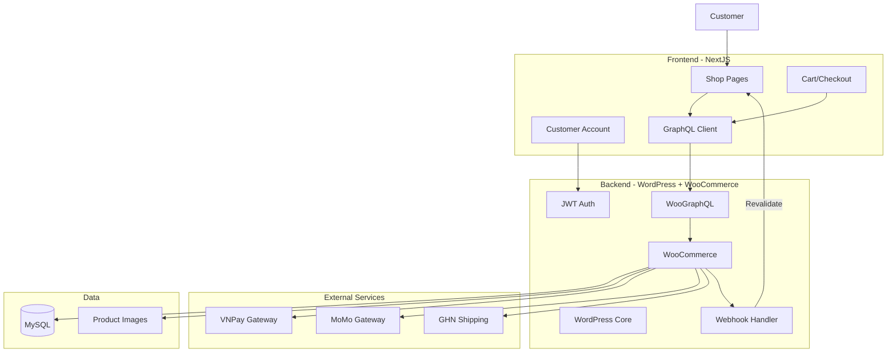

# Design Document: WordPress E-commerce CMS Setup

## Overview

Thiết kế này mô tả cách cấu hình WordPress với WooCommerce làm headless e-commerce backend cho website bán quần áo. WordPress sẽ quản lý sản phẩm, đơn hàng, thanh toán và expose data qua GraphQL cho NextJS frontend.

### Tech Stack

| Layer | Technology |
|-------|------------|
| CMS | WordPress 6.x |
| E-commerce | WooCommerce 8.x |
| GraphQL API | WPGraphQL + WooGraphQL |
| Authentication | JWT Authentication for WP REST API |
| Payment | VNPay, MoMo, COD |
| Shipping | GHN, GHTK, Viettel Post APIs |
| Local Dev | Docker Compose |

## Architecture

### High-Level Architecture




## Components and Interfaces

### 1. Required WordPress Plugins

```
wordpress/plugins/
├── woocommerce/                    # Core e-commerce
├── wp-graphql/                     # GraphQL API
├── wp-graphql-woocommerce/         # WooGraphQL
├── jwt-authentication-for-wp-rest-api/  # JWT Auth
├── woocommerce-gateway-vnpay/      # VNPay payment
├── woocommerce-momo-payment/       # MoMo payment
├── advanced-custom-fields-pro/     # Custom fields
└── wp-graphql-acf/                 # ACF GraphQL support
```

### 2. Docker Compose Update

```yaml
# docker-compose.yml additions
services:
  wordpress:
    build:
      context: ./wordpress
      dockerfile: Dockerfile
    environment:
      # ... existing env vars
      WOOCOMMERCE_CURRENCY: VND
      WOOCOMMERCE_COUNTRY: VN
      JWT_AUTH_SECRET_KEY: your-secret-key-here
    volumes:
      - ./wordpress/plugins/woocommerce:/var/www/html/wp-content/plugins/woocommerce
      - ./wordpress/plugins/wp-graphql-woocommerce:/var/www/html/wp-content/plugins/wp-graphql-woocommerce
```

### 3. WooCommerce Configuration

```php
// wordpress/themes/headless-theme/inc/woocommerce-setup.php
<?php
/**
 * WooCommerce Configuration for Headless Setup
 */

// Set default currency to VND
add_filter('woocommerce_currency', function() {
    return 'VND';
});

// Set default country to Vietnam
add_filter('woocommerce_countries_base_country', function() {
    return 'VN';
});

// Configure product attributes
function setup_clothing_attributes() {
    // Size attribute
    $size_attribute = array(
        'name' => 'Size',
        'slug' => 'pa_size',
        'type' => 'select',
        'order_by' => 'menu_order',
        'has_archives' => true,
    );
    
    // Color attribute  
    $color_attribute = array(
        'name' => 'Color',
        'slug' => 'pa_color',
        'type' => 'color',
        'order_by' => 'menu_order',
        'has_archives' => true,
    );
    
    // Register attributes
    wc_create_attribute($size_attribute);
    wc_create_attribute($color_attribute);
    
    // Add size terms
    $sizes = array('XS', 'S', 'M', 'L', 'XL', 'XXL');
    foreach ($sizes as $size) {
        wp_insert_term($size, 'pa_size');
    }
}
add_action('init', 'setup_clothing_attributes');
```


### 4. GraphQL Schema Extensions

```graphql
# WooGraphQL provides these types automatically

type Product {
  id: ID!
  databaseId: Int!
  name: String!
  slug: String!
  type: ProductTypesEnum!
  description: String
  shortDescription: String
  sku: String
  price: String
  regularPrice: String
  salePrice: String
  onSale: Boolean
  stockStatus: StockStatusEnum
  stockQuantity: Int
  image: MediaItem
  galleryImages: MediaItemConnection
  productCategories: ProductCategoryConnection
  attributes: ProductAttributeConnection
  variations: ProductVariationConnection  # For variable products
  averageRating: Float
  reviewCount: Int
}

type ProductVariation {
  id: ID!
  databaseId: Int!
  name: String!
  sku: String
  price: String
  regularPrice: String
  salePrice: String
  stockStatus: StockStatusEnum
  stockQuantity: Int
  attributes: VariationAttributeConnection
  image: MediaItem
}

type Cart {
  contents: CartItemConnection
  subtotal: String
  shippingTotal: String
  total: String
  appliedCoupons: AppliedCouponConnection
}

type Order {
  id: ID!
  databaseId: Int!
  orderNumber: String!
  status: OrderStatusEnum
  date: String
  total: String
  subtotal: String
  shippingTotal: String
  customer: Customer
  lineItems: LineItemConnection
  shippingAddress: Address
  billingAddress: Address
  paymentMethod: String
}
```

### 5. Product Category Hierarchy

```php
// wordpress/themes/headless-theme/inc/product-categories.php
<?php
/**
 * Setup default product categories for clothing store
 */
function setup_clothing_categories() {
    $categories = array(
        'ao' => array(
            'name' => 'Áo',
            'children' => array(
                'ao-thun' => 'Áo Thun',
                'ao-so-mi' => 'Áo Sơ Mi',
                'ao-khoac' => 'Áo Khoác',
                'ao-len' => 'Áo Len',
            )
        ),
        'quan' => array(
            'name' => 'Quần',
            'children' => array(
                'quan-jean' => 'Quần Jean',
                'quan-tay' => 'Quần Tây',
                'quan-short' => 'Quần Short',
            )
        ),
        'vay-dam' => array(
            'name' => 'Váy & Đầm',
            'children' => array(
                'vay-ngan' => 'Váy Ngắn',
                'dam-maxi' => 'Đầm Maxi',
                'dam-cong-so' => 'Đầm Công Sở',
            )
        ),
        'phu-kien' => array(
            'name' => 'Phụ Kiện',
            'children' => array(
                'tui-xach' => 'Túi Xách',
                'that-lung' => 'Thắt Lưng',
                'mu-non' => 'Mũ Nón',
            )
        ),
    );
    
    foreach ($categories as $slug => $data) {
        $parent = wp_insert_term($data['name'], 'product_cat', array('slug' => $slug));
        if (!is_wp_error($parent) && isset($data['children'])) {
            foreach ($data['children'] as $child_slug => $child_name) {
                wp_insert_term($child_name, 'product_cat', array(
                    'slug' => $child_slug,
                    'parent' => $parent['term_id']
                ));
            }
        }
    }
}
register_activation_hook(__FILE__, 'setup_clothing_categories');
```


### 6. Shipping Configuration

```php
// wordpress/themes/headless-theme/inc/shipping-setup.php
<?php
/**
 * Vietnam Shipping Zones Configuration
 */
function setup_vietnam_shipping_zones() {
    // Zone 1: Ho Chi Minh City
    $zone_hcm = new WC_Shipping_Zone();
    $zone_hcm->set_zone_name('Hồ Chí Minh');
    $zone_hcm->add_location('VN:SG', 'state');
    $zone_hcm->save();
    
    // Add flat rate for HCM
    $zone_hcm->add_shipping_method('flat_rate');
    
    // Zone 2: Hanoi
    $zone_hn = new WC_Shipping_Zone();
    $zone_hn->set_zone_name('Hà Nội');
    $zone_hn->add_location('VN:HN', 'state');
    $zone_hn->save();
    
    // Zone 3: Other provinces
    $zone_other = new WC_Shipping_Zone();
    $zone_other->set_zone_name('Tỉnh Thành Khác');
    $zone_other->add_location('VN', 'country');
    $zone_other->save();
}

// Free shipping threshold
add_filter('woocommerce_package_rates', function($rates, $package) {
    $free_shipping_threshold = 500000; // 500,000 VND
    $cart_total = WC()->cart->get_subtotal();
    
    if ($cart_total >= $free_shipping_threshold) {
        foreach ($rates as $rate_key => $rate) {
            if ($rate->method_id !== 'free_shipping') {
                $rates[$rate_key]->cost = 0;
                $rates[$rate_key]->label = 'Miễn phí vận chuyển';
            }
        }
    }
    return $rates;
}, 10, 2);
```

### 7. JWT Authentication Setup

```php
// wordpress/themes/headless-theme/inc/jwt-config.php
<?php
/**
 * JWT Authentication Configuration
 */

// Add JWT secret to wp-config.php
define('JWT_AUTH_SECRET_KEY', 'your-secret-key-minimum-32-characters');
define('JWT_AUTH_CORS_ENABLE', true);

// Extend token expiration
add_filter('jwt_auth_expire', function() {
    return time() + (DAY_IN_SECONDS * 7); // 7 days
});

// Add user data to JWT response
add_filter('jwt_auth_token_before_dispatch', function($data, $user) {
    $customer = new WC_Customer($user->ID);
    
    $data['user_email'] = $user->user_email;
    $data['user_display_name'] = $user->display_name;
    $data['billing_address'] = $customer->get_billing();
    $data['shipping_address'] = $customer->get_shipping();
    
    return $data;
}, 10, 2);
```

### 8. Webhook Configuration

```php
// wordpress/themes/headless-theme/inc/webhooks.php
<?php
/**
 * Webhook triggers for NextJS revalidation
 */

define('NEXTJS_REVALIDATE_URL', 'http://localhost:3000/api/revalidate');
define('NEXTJS_REVALIDATE_SECRET', 'your-revalidate-secret-32-chars');

function trigger_nextjs_revalidation($type, $slug = null, $data = array()) {
    $payload = array_merge(array(
        'type' => $type,
        'slug' => $slug,
        'timestamp' => time(),
    ), $data);
    
    wp_remote_post(NEXTJS_REVALIDATE_URL, array(
        'headers' => array(
            'Content-Type' => 'application/json',
            'x-revalidate-secret' => NEXTJS_REVALIDATE_SECRET,
        ),
        'body' => json_encode($payload),
        'timeout' => 5,
    ));
}

// Product created/updated
add_action('woocommerce_update_product', function($product_id) {
    $product = wc_get_product($product_id);
    trigger_nextjs_revalidation('product', $product->get_slug(), array(
        'product_id' => $product_id,
        'stock_status' => $product->get_stock_status(),
    ));
});

// Order status changed
add_action('woocommerce_order_status_changed', function($order_id, $old_status, $new_status) {
    trigger_nextjs_revalidation('order', null, array(
        'order_id' => $order_id,
        'old_status' => $old_status,
        'new_status' => $new_status,
    ));
}, 10, 3);

// Stock quantity changed
add_action('woocommerce_product_set_stock', function($product) {
    trigger_nextjs_revalidation('inventory', $product->get_slug(), array(
        'product_id' => $product->get_id(),
        'stock_quantity' => $product->get_stock_quantity(),
        'stock_status' => $product->get_stock_status(),
    ));
});
```


## Data Models

### Product Data Structure

```typescript
// Types for NextJS frontend consumption
interface WooProduct {
  id: string;
  databaseId: number;
  name: string;
  slug: string;
  type: 'SIMPLE' | 'VARIABLE' | 'GROUPED' | 'EXTERNAL';
  description: string;
  shortDescription: string;
  sku: string;
  price: string;           // Formatted: "350,000₫"
  regularPrice: string;
  salePrice: string | null;
  onSale: boolean;
  stockStatus: 'IN_STOCK' | 'OUT_OF_STOCK' | 'ON_BACKORDER';
  stockQuantity: number | null;
  image: WooImage;
  galleryImages: WooImage[];
  categories: WooCategory[];
  attributes: WooAttribute[];
  variations?: WooVariation[];  // Only for variable products
  averageRating: number;
  reviewCount: number;
}

interface WooVariation {
  id: string;
  databaseId: number;
  sku: string;
  price: string;
  regularPrice: string;
  salePrice: string | null;
  stockStatus: 'IN_STOCK' | 'OUT_OF_STOCK' | 'ON_BACKORDER';
  stockQuantity: number | null;
  attributes: {
    name: string;   // e.g., "pa_size"
    value: string;  // e.g., "M"
  }[];
  image: WooImage | null;
}

interface WooCategory {
  id: string;
  databaseId: number;
  name: string;
  slug: string;
  description: string;
  image: WooImage | null;
  parent: WooCategory | null;
  children: WooCategory[];
  count: number;
}

interface WooAttribute {
  id: string;
  name: string;        // e.g., "Size"
  slug: string;        // e.g., "pa_size"
  options: string[];   // e.g., ["S", "M", "L"]
  variation: boolean;  // Used for variations
  visible: boolean;
}

interface WooCart {
  contents: WooCartItem[];
  subtotal: string;
  subtotalTax: string;
  shippingTotal: string;
  shippingTax: string;
  discountTotal: string;
  total: string;
  totalTax: string;
  appliedCoupons: WooCoupon[];
  chosenShippingMethods: string[];
  availableShippingMethods: WooShippingMethod[];
}

interface WooCartItem {
  key: string;
  product: WooProduct;
  variation: WooVariation | null;
  quantity: number;
  subtotal: string;
  total: string;
}

interface WooOrder {
  id: string;
  databaseId: number;
  orderNumber: string;
  status: 'PENDING' | 'PROCESSING' | 'ON_HOLD' | 'COMPLETED' | 'CANCELLED' | 'REFUNDED' | 'FAILED';
  date: string;
  dateCompleted: string | null;
  subtotal: string;
  shippingTotal: string;
  discountTotal: string;
  total: string;
  paymentMethod: string;
  paymentMethodTitle: string;
  customer: WooCustomer;
  billing: WooAddress;
  shipping: WooAddress;
  lineItems: WooLineItem[];
  shippingLines: WooShippingLine[];
  customerNote: string;
}

interface WooCustomer {
  id: string;
  databaseId: number;
  email: string;
  firstName: string;
  lastName: string;
  displayName: string;
  billing: WooAddress;
  shipping: WooAddress;
  orders: WooOrder[];
}

interface WooAddress {
  firstName: string;
  lastName: string;
  company: string;
  address1: string;
  address2: string;
  city: string;
  state: string;
  postcode: string;
  country: string;
  phone: string;
  email?: string;  // Only in billing
}

interface WooReview {
  id: string;
  databaseId: number;
  rating: number;        // 1-5
  content: string;
  date: string;
  author: {
    name: string;
    email: string;
  };
  verified: boolean;     // Verified purchase
  status: 'APPROVED' | 'PENDING' | 'SPAM' | 'TRASH';
  product: WooProduct;
}
```


## Correctness Properties

*A property is a characteristic or behavior that should hold true across all valid executions of a system-essentially, a formal statement about what the system should do. Properties serve as the bridge between human-readable specifications and machine-verifiable correctness guarantees.*

### Property 1: Variable product variation data integrity

*For any* variable product with variations, each variation SHALL have its own unique SKU, individual stock quantity tracking, and correctly associated attribute values (size, color).

**Validates: Requirements 2.4, 3.4, 5.1**

### Property 2: Category hierarchy consistency

*For any* product category with a parent category, the parent-child relationship SHALL be correctly maintained in both database storage and GraphQL query responses.

**Validates: Requirements 4.1**

### Property 3: Stock status synchronization

*For any* product variation where stock quantity equals zero and backorders are disabled, the stock status SHALL automatically be set to "OUT_OF_STOCK".

**Validates: Requirements 5.2**

### Property 4: Price field completeness

*For any* product (simple or variation), both regular price and sale price fields SHALL be available, with sale price being null or empty when no sale is active.

**Validates: Requirements 6.1**

### Property 5: Coupon restriction enforcement

*For any* coupon with minimum order amount restriction, the coupon SHALL NOT be applicable to orders below the specified minimum amount.

**Validates: Requirements 6.4**

### Property 6: Order data completeness

*For any* order created through checkout, the order record SHALL contain: customer details (name, email, phone), billing address, shipping address, and complete line items with product/variation references.

**Validates: Requirements 7.1**

### Property 7: Order status workflow validity

*For any* order status transition, the new status SHALL be a valid transition from the current status according to WooCommerce workflow (e.g., cannot go from COMPLETED to PENDING).

**Validates: Requirements 7.3**

### Property 8: Shipping zone rate application

*For any* shipping address within a defined shipping zone, the correct shipping rate for that zone SHALL be applied to the order.

**Validates: Requirements 9.1**

### Property 9: Shipping cost calculation

*For any* order with shipping, the shipping cost SHALL be correctly calculated based on the selected shipping method's rules (weight-based, total-based, or flat rate).

**Validates: Requirements 9.2**

### Property 10: Free shipping threshold

*For any* order with subtotal greater than or equal to the free shipping threshold, shipping cost SHALL be zero when free shipping is enabled.

**Validates: Requirements 9.3**

### Property 11: JWT authentication validity

*For any* valid customer credentials (email/password), the authentication endpoint SHALL return a valid JWT token containing user ID and expiration timestamp.

**Validates: Requirements 10.2**

### Property 12: Customer order history retrieval

*For any* authenticated customer with previous orders, the account endpoint SHALL return complete order history including all order details and statuses.

**Validates: Requirements 10.3**

### Property 13: Multiple shipping addresses storage

*For any* customer account, the system SHALL support storing and retrieving multiple shipping addresses without data loss or corruption.

**Validates: Requirements 10.4**

### Property 14: Review data storage

*For any* submitted product review, the system SHALL store the rating (1-5), comment text, author information, and associated product ID correctly.

**Validates: Requirements 11.1**

### Property 15: Verified purchase badge accuracy

*For any* product review where the reviewer has a completed order containing that product, the review SHALL be marked as "verified purchase".

**Validates: Requirements 11.2**

### Property 16: Review moderation default status

*For any* newly submitted review, the initial status SHALL be "PENDING" until explicitly approved by an administrator.

**Validates: Requirements 11.3**

### Property 17: Average rating calculation

*For any* product with approved reviews, the average rating SHALL equal the arithmetic mean of all approved review ratings, rounded to one decimal place.

**Validates: Requirements 11.4**

### Property 18: Webhook authentication header

*For any* webhook request sent to the NextJS revalidation endpoint, the request SHALL include the `x-revalidate-secret` header with the configured secret value.

**Validates: Requirements 12.4**


## Error Handling

### GraphQL Error Responses

```php
// wordpress/themes/headless-theme/inc/graphql-errors.php
<?php
/**
 * Custom GraphQL error handling for WooCommerce
 */

add_filter('graphql_response_errors', function($errors, $response, $schema, $operation) {
    $formatted_errors = array();
    
    foreach ($errors as $error) {
        $formatted_errors[] = array(
            'message' => $error->getMessage(),
            'code' => $error->getCode() ?: 'INTERNAL_ERROR',
            'path' => $error->getPath(),
            'extensions' => array(
                'category' => get_error_category($error),
            ),
        );
    }
    
    return $formatted_errors;
}, 10, 4);

function get_error_category($error) {
    $message = strtolower($error->getMessage());
    
    if (strpos($message, 'not found') !== false) {
        return 'NOT_FOUND';
    }
    if (strpos($message, 'unauthorized') !== false || strpos($message, 'permission') !== false) {
        return 'UNAUTHORIZED';
    }
    if (strpos($message, 'validation') !== false || strpos($message, 'invalid') !== false) {
        return 'VALIDATION_ERROR';
    }
    if (strpos($message, 'stock') !== false) {
        return 'STOCK_ERROR';
    }
    
    return 'INTERNAL_ERROR';
}
```

### WooCommerce Error Codes

| Error Code | Description | HTTP Status |
|------------|-------------|-------------|
| `PRODUCT_NOT_FOUND` | Product does not exist | 404 |
| `VARIATION_NOT_FOUND` | Product variation does not exist | 404 |
| `OUT_OF_STOCK` | Product/variation is out of stock | 400 |
| `INSUFFICIENT_STOCK` | Requested quantity exceeds available stock | 400 |
| `INVALID_COUPON` | Coupon code is invalid or expired | 400 |
| `COUPON_MIN_AMOUNT` | Order does not meet minimum amount for coupon | 400 |
| `INVALID_SHIPPING_ADDRESS` | Shipping address is incomplete or invalid | 400 |
| `PAYMENT_FAILED` | Payment processing failed | 402 |
| `UNAUTHORIZED` | User is not authenticated | 401 |
| `FORBIDDEN` | User does not have permission | 403 |

## Testing Strategy

### Unit Testing Framework

- **Framework**: PHPUnit for WordPress/WooCommerce
- **Testing Library**: WP_UnitTestCase, WC_Unit_Test_Case
- **Mocking**: Brain Monkey for WordPress hooks/functions

### Property-Based Testing

- **Framework**: fast-check (for NextJS integration tests)
- **PHP PBT**: Eris (PHP property-based testing library)
- **Minimum iterations**: 100 per property test

**Test Annotation Format:**
```php
/**
 * **Feature: wordpress-ecommerce-cms, Property {number}: {property_text}**
 * **Validates: Requirements X.Y**
 */
```

### Test Structure

```
wordpress/
├── tests/
│   ├── phpunit/
│   │   ├── bootstrap.php
│   │   ├── unit/
│   │   │   ├── WooCommerceSetupTest.php
│   │   │   ├── ProductAttributesTest.php
│   │   │   ├── ShippingZonesTest.php
│   │   │   └── WebhookTest.php
│   │   └── properties/
│   │       ├── VariationDataIntegrityTest.php
│   │       ├── StockStatusTest.php
│   │       ├── OrderWorkflowTest.php
│   │       └── ReviewCalculationTest.php
│   └── integration/
│       ├── GraphQLProductsTest.php
│       ├── GraphQLCartTest.php
│       └── GraphQLOrdersTest.php
```

### Example Property Test (PHP)

```php
<?php
// tests/phpunit/properties/StockStatusTest.php

use Eris\Generator;
use Eris\TestTrait;

/**
 * **Feature: wordpress-ecommerce-cms, Property 3: Stock status synchronization**
 * **Validates: Requirements 5.2**
 */
class StockStatusTest extends WC_Unit_Test_Case {
    use TestTrait;
    
    public function test_zero_stock_sets_out_of_stock_status() {
        $this->forAll(
            Generator\choose(0, 0),  // Stock quantity = 0
            Generator\bool()          // Backorders enabled
        )->then(function($stock_qty, $backorders_enabled) {
            // Create product variation
            $product = WC_Helper_Product::create_variation_product();
            $variation = wc_get_product($product->get_children()[0]);
            
            // Set stock
            $variation->set_manage_stock(true);
            $variation->set_stock_quantity($stock_qty);
            $variation->set_backorders($backorders_enabled ? 'yes' : 'no');
            $variation->save();
            
            // Reload and check
            $variation = wc_get_product($variation->get_id());
            
            if (!$backorders_enabled) {
                $this->assertEquals('outofstock', $variation->get_stock_status());
            }
        });
    }
}
```

### Integration Test Example

```php
<?php
// tests/integration/GraphQLProductsTest.php

class GraphQLProductsTest extends WC_Unit_Test_Case {
    
    public function test_variable_product_returns_all_variations() {
        // Create variable product with variations
        $product = WC_Helper_Product::create_variation_product();
        
        $query = '
            query GetProduct($slug: ID!) {
                product(id: $slug, idType: SLUG) {
                    ... on VariableProduct {
                        variations {
                            nodes {
                                id
                                sku
                                stockQuantity
                                attributes {
                                    nodes {
                                        name
                                        value
                                    }
                                }
                            }
                        }
                    }
                }
            }
        ';
        
        $response = graphql(array(
            'query' => $query,
            'variables' => array('slug' => $product->get_slug()),
        ));
        
        $this->assertArrayNotHasKey('errors', $response);
        $this->assertCount(
            count($product->get_children()),
            $response['data']['product']['variations']['nodes']
        );
    }
}
```
