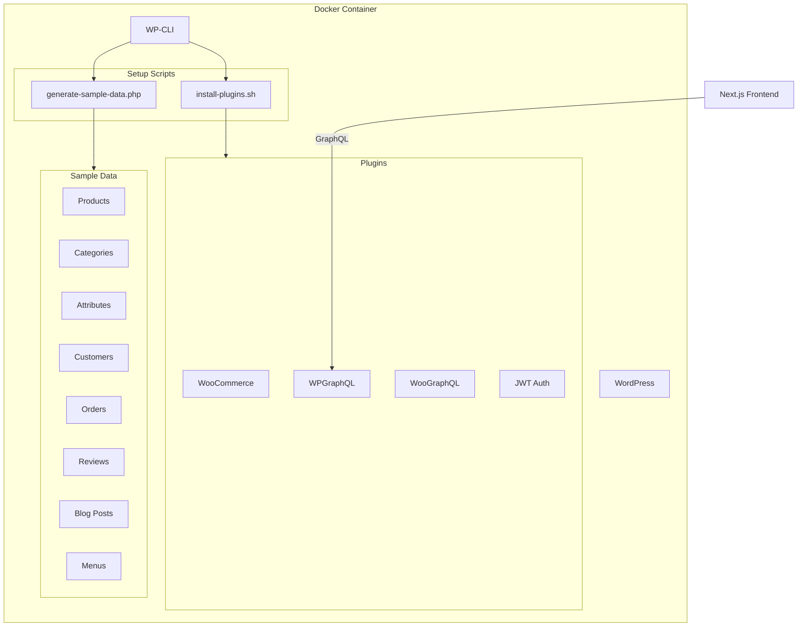

# Design Document: WordPress Sample Data Setup

## Overview

Hệ thống setup WordPress bao gồm 2 phần chính:
1. **Plugin Installer**: Script cài đặt và cấu hình các plugins cần thiết
2. **Sample Data Generator**: Script tạo dữ liệu mẫu cho WooCommerce và WordPress

Cả 2 scripts được thiết kế để chạy qua WP-CLI trong Docker container, đảm bảo tính nhất quán và có thể tái sử dụng.

## Architecture



## Components and Interfaces

### 1. Plugin Installer (`install-plugins.sh`)

Script bash cài đặt plugins qua WP-CLI.

**Interface:**
```bash
# Chạy trong Docker container
docker-compose exec wordpress bash /usr/local/bin/install-plugins.sh

# Hoặc với options
docker-compose exec wordpress bash /usr/local/bin/install-plugins.sh --skip-verify
```

**Plugins cài đặt:**
| Plugin | Slug | Purpose |
|--------|------|---------|
| WooCommerce | `woocommerce` | Core e-commerce |
| WPGraphQL | `wp-graphql` | GraphQL API |
| WooGraphQL | `wp-graphql-woocommerce` | WooCommerce GraphQL |
| JWT Auth | `jwt-authentication-for-wp-rest-api` | User authentication |
| ACF | `advanced-custom-fields` | Custom fields cho posts/products |
| WPGraphQL for ACF | `wpgraphql-acf` | Expose ACF fields qua GraphQL |

### 2. Sample Data Generator (`generate-sample-data.php`)

Script PHP chạy qua WP-CLI để tạo sample data.

**Interface:**
```bash
# Chạy full setup
docker-compose exec wordpress wp eval-file /var/www/html/wp-content/themes/headless-theme/scripts/generate-sample-data.php --allow-root

# Chạy với options
docker-compose exec wordpress wp eval-file ... --reset  # Reset existing data
docker-compose exec wordpress wp eval-file ... --skip-products  # Skip products
```

### 3. Data Generator Classes

```
SampleDataGenerator/
├── ProductGenerator.php      # Tạo products và variations
├── CategoryGenerator.php     # Tạo categories và tags
├── AttributeGenerator.php    # Tạo global attributes
├── CustomerGenerator.php     # Tạo customer accounts
├── OrderGenerator.php        # Tạo sample orders
├── ReviewGenerator.php       # Tạo product reviews
├── BlogGenerator.php         # Tạo blog posts
├── MenuGenerator.php         # Tạo navigation menus
├── ACFFieldsGenerator.php    # Tạo ACF field groups
└── ConfigGenerator.php       # Cấu hình WooCommerce
```

### 4. ACF Field Groups

Script sẽ tạo các ACF field groups sau:

**Blog Post Fields:**
- `related_products` (Relationship field) - Link posts với products
- `post_summary` (Text) - Tóm tắt ngắn cho SEO

**Product Fields (optional):**
- `video_url` (URL) - Video giới thiệu sản phẩm
- `size_guide` (WYSIWYG) - Hướng dẫn chọn size

## Data Models

### Product Data Structure

```php
$product = [
    'name' => 'Áo thun nam basic',
    'type' => 'simple|variable',
    'regular_price' => 299000,
    'sale_price' => 249000,  // optional
    'description' => '...',
    'short_description' => '...',
    'sku' => 'ATN-001',
    'stock_quantity' => 50,
    'stock_status' => 'instock|outofstock|onbackorder',
    'categories' => ['ao-thun', 'nam'],
    'tags' => ['basic', 'cotton'],
    'attributes' => [
        'size' => ['S', 'M', 'L', 'XL'],
        'color' => ['Đen', 'Trắng', 'Xám']
    ],
    'images' => ['url1', 'url2'],
    'variations' => [  // for variable products
        ['size' => 'S', 'color' => 'Đen', 'price' => 299000, 'stock' => 10],
        // ...
    ]
];
```

### Category Hierarchy

```
├── Thời trang nam
│   ├── Áo nam
│   │   ├── Áo thun
│   │   ├── Áo sơ mi
│   │   └── Áo khoác
│   └── Quần nam
│       ├── Quần jeans
│       └── Quần kaki
├── Thời trang nữ
│   ├── Áo nữ
│   └── Váy đầm
└── Phụ kiện
    ├── Túi xách
    ├── Giày dép
    └── Trang sức
```

### Blog Categories

```
├── Tin tức
├── Hướng dẫn
│   ├── Cách chọn size
│   ├── Bảo quản quần áo
└── Đánh giá sản phẩm
```

### Customer Data

```php
$customer = [
    'email' => 'customer1@example.com',
    'first_name' => 'Nguyễn',
    'last_name' => 'Văn A',
    'billing' => [
        'address_1' => '123 Nguyễn Huệ',
        'city' => 'Hồ Chí Minh',
        'state' => 'SG',
        'postcode' => '700000',
        'country' => 'VN',
        'phone' => '0901234567'
    ],
    'shipping' => [/* same structure */]
];
```

### Order Data

```php
$order = [
    'customer_id' => 1,
    'status' => 'pending|processing|completed|cancelled',
    'line_items' => [
        ['product_id' => 1, 'quantity' => 2],
        ['product_id' => 5, 'variation_id' => 12, 'quantity' => 1]
    ],
    'billing' => [/* customer billing */],
    'shipping' => [/* customer shipping */],
    'payment_method' => 'cod',
    'shipping_lines' => [
        ['method_id' => 'flat_rate', 'total' => 30000]
    ]
];
```


## Correctness Properties

*A property is a characteristic or behavior that should hold true across all valid executions of a system-essentially, a formal statement about what the system should do. Properties serve as the bridge between human-readable specifications and machine-verifiable correctness guarantees.*

Dựa trên phân tích acceptance criteria, các properties sau có thể được kiểm tra tự động:

### Property 1: Product Count Minimums
*For any* execution of the sample data generator, the total simple product count SHALL be at least 20 and variable product count SHALL be at least 10.
**Validates: Requirements 2.1, 2.2**

### Property 2: Stock Quantity Range
*For any* product created by the generator, the stock quantity SHALL be in the range [0, 100].
**Validates: Requirements 2.3**

### Property 3: Sale Price Distribution
*For any* execution of the sample data generator, at least 30% of products SHALL have a sale price set.
**Validates: Requirements 2.4**

### Property 4: Category Hierarchy Integrity
*For any* child category created, it SHALL have a valid parent category reference.
**Validates: Requirements 3.1**

### Property 5: Product Category Assignment
*For any* product created, it SHALL be assigned to at least one category AND at least one tag.
**Validates: Requirements 3.3**

### Property 6: Order Line Item Count
*For any* order created, the number of line items SHALL be in the range [1, 5].
**Validates: Requirements 5.3**

### Property 7: Review Rating Range
*For any* product review created, the rating SHALL be in the range [1, 5].
**Validates: Requirements 6.2**

### Property 8: Blog Post Content Structure
*For any* blog post created, it SHALL have a featured image AND content with at least one heading.
**Validates: Requirements 8.3**

### Property 9: Idempotency
*For any* two consecutive executions of the sample data generator (without reset), the data counts SHALL remain the same after the second run.
**Validates: Requirements 9.1**

### Property 10: Menu Location Assignment
*For any* menu created, it SHALL be assigned to a valid registered menu location.
**Validates: Requirements 10.3**

## Error Handling

### Plugin Installation Errors

| Error | Handling |
|-------|----------|
| Plugin not found | Log error, continue with other plugins |
| Network timeout | Retry 3 times with exponential backoff |
| Activation failed | Log error, suggest manual activation |
| Dependency missing | Install dependency first, then retry |

### Sample Data Generation Errors

| Error | Handling |
|-------|----------|
| Duplicate SKU | Append random suffix to SKU |
| Invalid category | Create category if not exists |
| Image download failed | Use placeholder image |
| Customer email exists | Skip customer creation |
| Order creation failed | Log error, continue with next order |

### Recovery Strategy

```php
try {
    $generator->createProducts();
} catch (Exception $e) {
    log_error("Product creation failed: " . $e->getMessage());
    // Continue with partial data
    $generator->markPartialCompletion('products');
}
```

## Testing Strategy

### Unit Testing

Do đây là scripts chạy trong WordPress environment, unit tests sẽ sử dụng WP Test Framework:

1. **Plugin Installation Tests**
   - Test plugin detection
   - Test activation status check
   - Test GraphQL endpoint verification

2. **Data Generator Tests**
   - Test individual generator classes
   - Test data validation functions
   - Test idempotency logic

### Property-Based Testing

Sử dụng **PHPUnit** với custom assertions để verify properties:

```php
// Example: Property 2 - Stock Quantity Range
public function testStockQuantityRange() {
    $products = wc_get_products(['limit' => -1]);
    foreach ($products as $product) {
        $stock = $product->get_stock_quantity();
        $this->assertGreaterThanOrEqual(0, $stock);
        $this->assertLessThanOrEqual(100, $stock);
    }
}
```

### Integration Testing

1. **Full Setup Test**
   - Run complete setup script
   - Verify all plugins active
   - Verify all data created
   - Test GraphQL queries return expected data

2. **Idempotency Test**
   - Run setup twice
   - Verify no duplicate data

### Test Execution

```bash
# Run all tests
docker-compose exec wordpress wp eval-file /path/to/tests/run-tests.php --allow-root

# Run specific test
docker-compose exec wordpress wp eval-file /path/to/tests/test-products.php --allow-root
```

